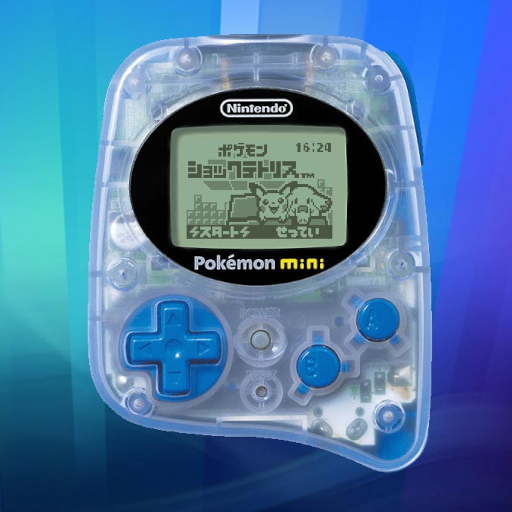

# Nintendo - Pokemon Mini (PokeMini)

### Description

PokeMini emulates the obscure Pokémon Mini handheld. While functional, it does not support color files or savestates currently.

To use a real BIOS, place *bios.min* in the emulator's userdata folder.

### License

GPLv3

### Icon

### Fanart

Help make me fanart!

### Screenshots

Help make me screenshots!
